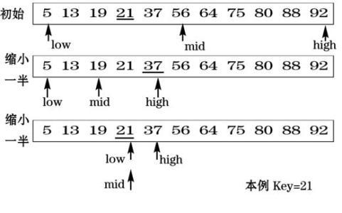

#### 二分查找

##### 一、前言

二分查找是一种效率很高的查找算法，相对于简单线性查找，效率高很多

二分查找的前提是，数组列表必须是有序的。思想是DC分治法(Divide and Conquer)的典型应用


##### 二、查找思想

每次都将数组折半进行查找，小了大了就分别在另外部分进行查找，时间复杂度O(log n)




##### 三、代码实现

```python
def binary_search(array, item):
    """ 二分查找, 在有序array中查找item元素, 返回下标 时间复杂度O(log n) """
    low = 0
    high = len(array) - 1

    while low <= high:
        mid = low + high // 2
        guess = array[mid]  # 猜中间, 数组必须是有序的

        if item == guess:
            # 找到直接返回
            return mid
        elif item > guess:
            # 猜小了, 在 后半部分继续找
            low = mid + 1
        elif item < guess:
            # 猜大了, 在 左半部分继续找
            high = mid - 1

    return None  # 没有找到


if __name__ == '__main__':
    my_list = [1, 5, 7, 22, 32, 52]
    print(binary_search(my_list, 52))  # 4
    print(binary_search(my_list, 88))  # None
```
